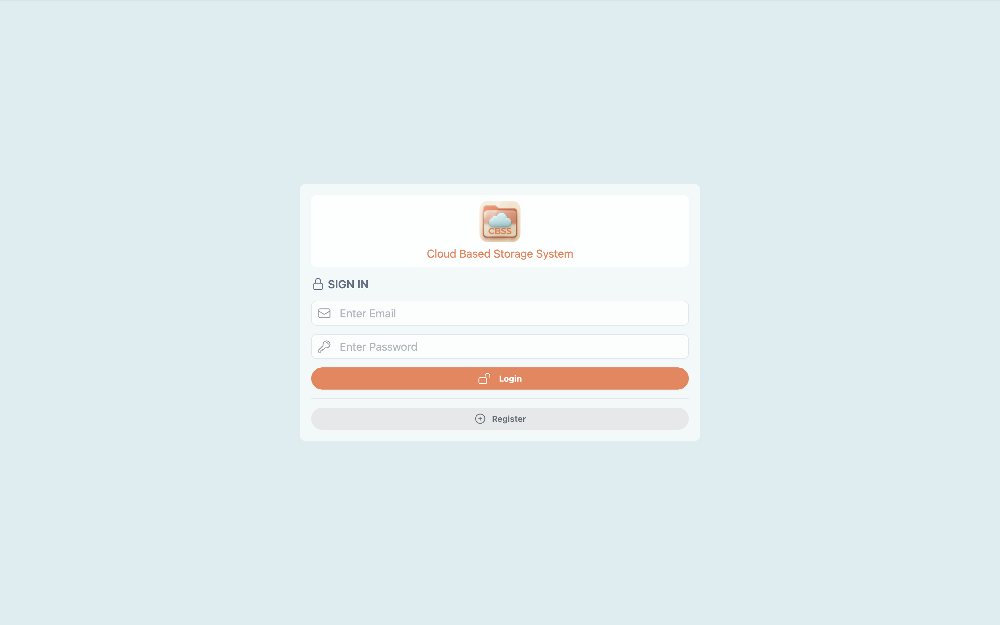
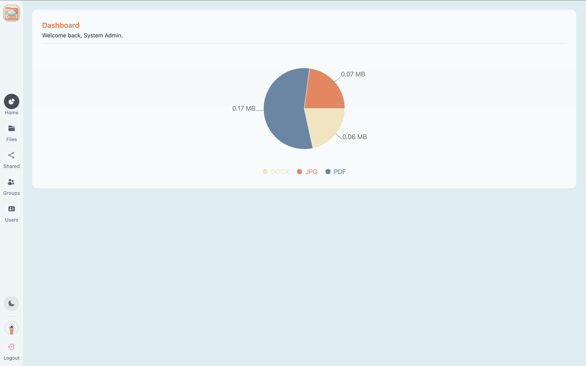
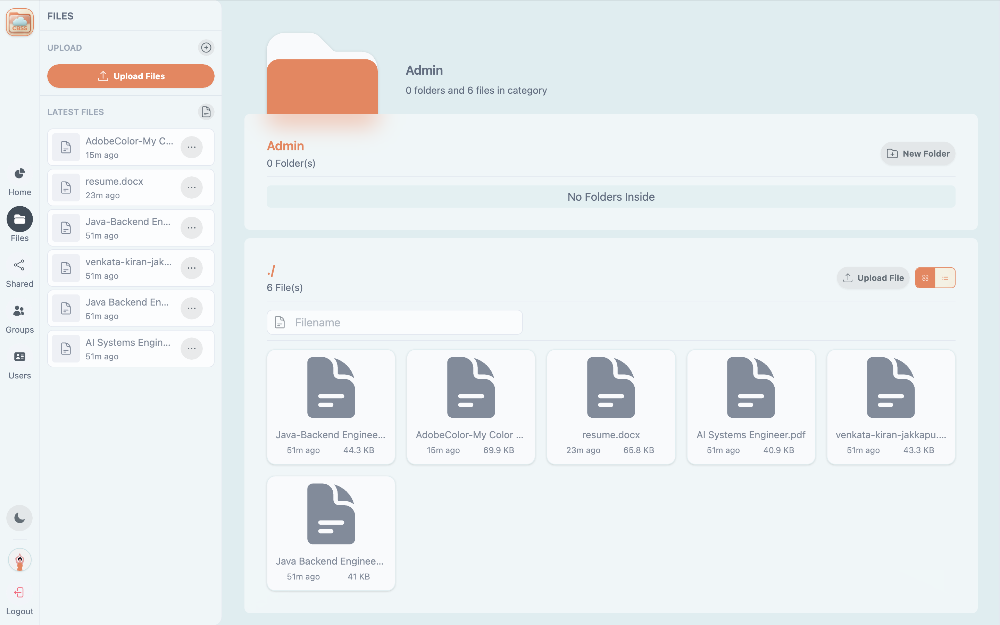
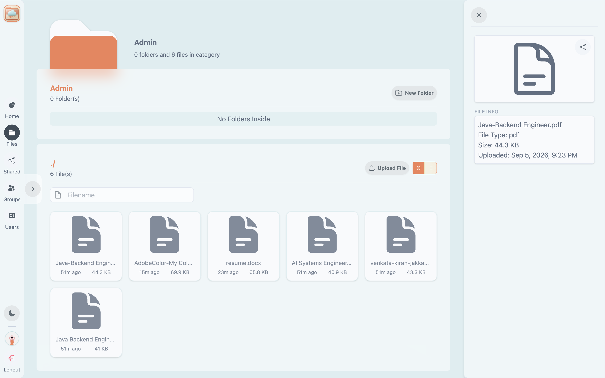
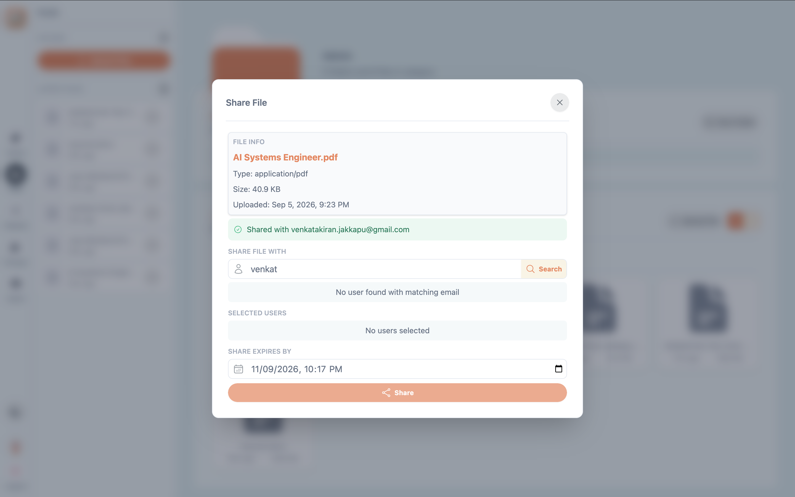
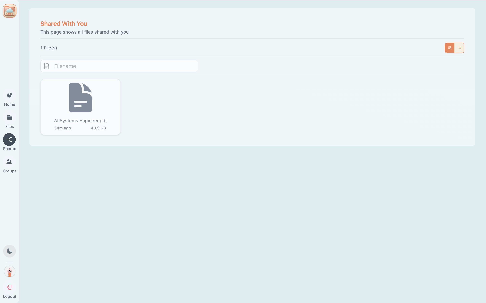
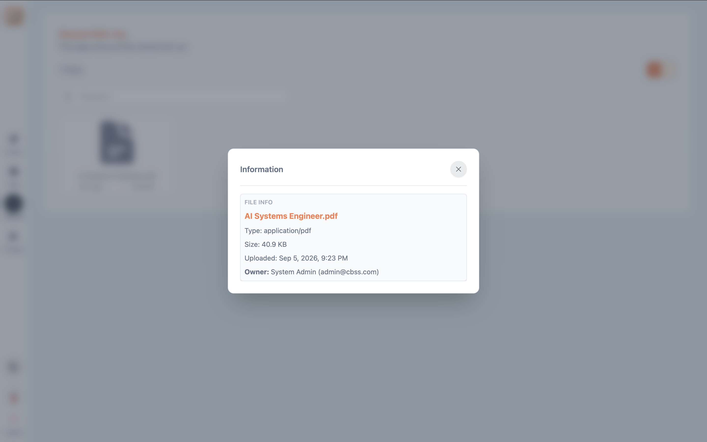

# Cloud-Based Storage System (CBSS)

> A cloud-native microservices-based file storage and sharing system built with Spring Boot, Spring Cloud, React, and reusable platform architecture.


---

# Overview

The **Cloud-Based Storage System (CBSS)** is a cloud-native application designed to provide secure file storage, folder management, file sharing, user management, and storage reporting through a distributed microservices architecture.

The system separates authentication, file storage, and reporting capabilities into independently deployable services.

The project also includes a reusable **Labmantix Platform** that provides common infrastructure capabilities such as security, centralized exception handling, logging, request-context propagation, and HTTP client configuration.

The application supports two primary roles:

* **Administrators** — manage users and access administrative functionality.
* **Users** — manage files and folders, upload and download files, share files, manage shared resources, and access storage information.

The system demonstrates modern enterprise software engineering practices including:

* Microservices architecture
* Domain-oriented service decomposition
* JWT-based authentication and authorization
* Role-based access control
* Centralized configuration management
* Service discovery
* API Gateway routing
* Reusable Spring Boot platform starters
* Request correlation and centralized logging
* Inter-service communication
* RESTful API design
* Automated request-context and bearer-token propagation
* Database per service
* Local file-system based object storage
* React-based SPA architecture

---

# Features

## Backend

* User registration and management
* JWT authentication
* Access and refresh token management
* Role-based authorization
* User profile management
* Password changes
* User roles
* Address management
* Nominee information
* File upload
* File download
* File metadata management
* File deletion
* File version management
* Latest-file retrieval
* Folder creation and management
* Root-folder creation
* Hierarchical directory structure
* Directory tree retrieval
* Breadcrumb path resolution
* File sharing
* Private and public sharing
* User-based file access
* Group-based file access
* Shared file management
* File access records
* Storage reports
* File reports
* Centralized configuration
* Service discovery
* API Gateway routing
* Centralized request and exception logging
* Standardized API error responses
* Inter-service authentication propagation
* OpenAPI / Swagger documentation

## Frontend

* React-based single-page application
* TypeScript
* Vite
* JWT authentication
* Protected routes
* Role-based UI
* User profile management
* File browser
* Folder navigation
* Directory tree
* Breadcrumb navigation
* File upload
* File download
* File deletion
* File management
* File sharing
* Shared files
* Groups
* User management
* Storage reports
* File reports
* Reusable form and UI components
* Pagination
* Floating action menus
* Axios API integration
* JWT request/response interceptors
* Responsive dashboard layouts
* Recharts-based reporting visualizations

---

# Architecture

The application follows a **microservices architecture** where business capabilities are separated into independently deployable services.

```text
                         +--------------------------------+
                         |            Client              |
                         |       React + TypeScript       |
                         +---------------+----------------+
                                         |
                                         |
                                  +------v-------+
                                  | API Gateway  |
                                  +------+-------+
                                         |
                     +-------------------+-------------------+
                     |                   |                   |
              +------v------+     +------v------+     +------v------+
              |  Identity   |     |   Storage   |     |   Reports   |
              |   Service  |     |   Service   |     |   Service   |
              +------+------+     +------+------+     +------+------+
                     |                   |                   |
              +------v------+     +------v------+            |
              | PostgreSQL |     | PostgreSQL |            |
              |  Identity  |     |   Storage  |            |
              +-------------+     +-------------+            |
                                                            |
                              +-------------------------------+
                              |
                              |     Inter-Service Calls      |
                              |
                              +-------------------------------+
```

### Core Services

| Service          | Responsibility                                        |
| ---------------- | ----------------------------------------------------- |
| Identity Service | Authentication, authorization, and user management    |
| Storage Service  | Files, folders, metadata, access, sharing, and groups |
| Reports Service  | Storage and file reporting                            |
| API Gateway      | External API entry point and routing                  |

---

# Cloud Infrastructure

```text
                         +----------------------+
                         |     Config Server    |
                         +----------+-----------+
                                    |
                                    | Configuration
                                    |
              +---------------------+---------------------+
              |                     |                     |
       +------v------+       +------v------+       +------v------+
       | API Gateway |       |  Identity   |       |   Storage   |
       |             |       |   Service   |       |   Service   |
       +------+------+       +------+------+       +------+------+
              |                     |                     |
              +---------------------+---------------------+
                                    |
                            +-------v--------+
                            | Eureka Registry|
                            +----------------+
                                    |
                              +-----+-----+
                              |           |
                           Reports     Other Services
```

The services use **Netflix Eureka** for service discovery.

The API Gateway uses Eureka service names to dynamically locate service instances.

---

# Shared Platform

The application includes a reusable **Labmantix Platform** that provides infrastructure capabilities shared by the business services.

```text
Labmantix Platform
│
├── Web
│   └── Standardized HTTP Error Handling
│
├── Logging
│   ├── Request Context
│   ├── Correlation IDs
│   ├── Request Logging
│   ├── Response Logging
│   └── Exception Logging
│
├── Security
│   ├── JWT Resource Server
│   ├── Authentication Context
│   ├── Role-Based Authorization
│   └── Authenticated User Abstraction
│
└── RestClient
    ├── Request Context Propagation
    └── Bearer Token Propagation
```

The platform allows individual services to focus on business logic while common infrastructure is provided through Spring Boot auto-configuration.

## Web Module

Provides:

* Standardized error responses
* Framework exception handling
* Bean validation error mapping
* Extensible error definitions
* Centralized HTTP error handling

## Logging Module

Provides:

* Request context management
* Correlation ID generation
* Request logging
* Response logging
* Exception logging
* Rolling file logging
* Logback configuration

Requests can be associated with a correlation identifier using:

```text
X-Correlation-Id
```

## Security Module

Provides:

* JWT resource-server integration
* Stateless authentication
* Method-level authorization
* Authentication context abstraction
* Authenticated user abstraction
* Configurable JWT claim mapping
* Authentication and authorization error handling
* CORS configuration

## RestClient Module

Provides standardized propagation of:

* Request-context headers
* Correlation IDs
* Bearer authentication tokens

This allows authenticated downstream requests to retain the required security and request context.

---

# Services

## Identity Service

The Identity Service is responsible for authentication, authorization, and user management.

### Responsibilities

* User registration
* User creation
* User retrieval
* User updates
* User deletion
* User search
* Role management
* Login
* Logout
* Password changes
* Access-token generation
* Refresh-token management
* JWT validation
* Current-user retrieval
* User lookup by ID
* User lookup by email
* Address management
* Nominee information

### Authentication Flow

```text
Client
   |
   | Login Credentials
   v
Identity Service
   |
   | Validate Credentials
   v
User Repository
   |
   | Valid
   v
JWT Access Token
+
Refresh Token
   |
   v
Client
```

The Identity Service uses JWT-based stateless authentication while maintaining refresh tokens for access-token renewal.

---

# Storage Service

The Storage Service contains the core file-storage domain.

It is responsible for managing file metadata, physical file storage, folders, file access, sharing, and storage-related operations.

### Responsibilities

* File upload
* File download
* File deletion
* File metadata management
* File updates
* File version management
* Latest-file retrieval
* Folder creation
* Folder updates
* Folder deletion
* Root-folder management
* Directory navigation
* Directory tree retrieval
* Breadcrumb path resolution
* File sharing
* Shared-file retrieval
* Access management
* User-based file access
* Group-based file access
* Public and private sharing
* Storage reports

### Storage Model

```text
User
│
└── Root Folder
    │
    ├── Folder
    │   ├── Folder
    │   │   └── Files
    │   │
    │   └── Files
    │
    └── Files
```

### File Metadata

File metadata is persisted in PostgreSQL while the physical file content is stored in the configured local file-system storage.

```text
                    Storage Service
                          |
             +------------+------------+
             |                         |
             v                         v
       PostgreSQL                 File System
       File Metadata              File Content
             |                         |
             +------------+------------+
                          |
                     File Operations
```

The configured local storage base path is:

```text
filestore
```

User files are organized underneath user-specific storage directories.

---

# File Sharing

CBSS supports controlled sharing of files with users and groups.

The storage domain contains access and sharing models including:

* Owner access
* Member access
* Group access
* Public sharing
* Private sharing

```text
                    File
                     |
          +----------+----------+
          |          |          |
        Owner      User       Group
          |          |          |
       OWNER      MEMBER      GROUP
```

Files can be shared with specific users, and access records can subsequently be removed.

---

# Groups

The Storage Service contains group-related domain models for managing group participants and group-based file access.

```text
Group
│
├── Group Participant
├── Group Participant
└── Group Participant
         |
         v
      Shared File
```

This allows files to be shared through group membership in addition to direct user access.

---

# File Versions

The Storage Service supports file-version retrieval.

```text
File
│
├── Version 1
├── Version 2
├── Version 3
└── Latest Version
```

The application can retrieve the latest file information as well as available file versions.

---

# Reports Service

The Reports Service provides reporting functionality based on storage and file information.

### Responsibilities

* File reports
* File metadata reporting
* File access information
* File sharing information
* User-related file information
* Aggregated storage information

The Reports Service communicates with other services when additional storage or user information is required.

### Reporting Flow

```text
Client
   |
   v
API Gateway
   |
   v
Reports Service
   |
   +--------------------+
   |                    |
   v                    v
Identity Service   Storage Service
   |                    |
   +---------+----------+
             |
             v
       Report Response
```

---

# API Gateway

The API Gateway provides the external entry point into the backend services.

Routes are configured using **Spring Cloud Gateway** and Eureka service discovery.

```text
/identity/**  →  lb://cbss-identity-service

/storage/**   →  lb://cbss-storage-service

/reports/**   →  lb://cbss-reports-service
```

The `lb://` routes allow requests to be resolved through the Eureka service registry rather than relying on fixed service addresses.

The gateway runs on:

```text
http://localhost:9090
```

---

# Config Server

The Config Server provides centralized configuration for the distributed services.

Configuration is maintained separately from individual services and includes:

* Database configuration
* Eureka configuration
* Service URLs
* Security configuration
* Logging configuration
* RestClient configuration
* API Gateway routes
* File storage configuration
* Multipart upload configuration
* CORS configuration

### Configuration Repository

```text
cloud/repo/
│
├── application.yml
├── cbss-api-gateway.yml
├── cbss-identity-service.yml
├── cbss-storage-service.yml
└── cbss-reports-service.yml
```

This allows common configuration to be shared while service-specific configuration remains isolated.

The Config Server runs on:

```text
http://localhost:8888
```

---

# Service Registry

The application uses **Netflix Eureka** as its service registry.

Services register themselves with Eureka and use the registry for service discovery.

```text
                    +------------------+
                    | Eureka Registry  |
                    +--------+---------+
                             |
              +--------------+--------------+
              |              |              |
              v              v              v
         Identity         Storage        Reports
         Service          Service        Service
```

The API Gateway uses the registered service names to locate service instances dynamically.

The Eureka server runs on:

```text
http://localhost:8761
```

---

# Frontend Architecture

The frontend is implemented as a React single-page application using TypeScript and Vite.

```text
React Application
│
├── Context
│   └── Authentication
│
├── Routes
│   ├── Landing
│   ├── Dashboard
│   ├── Profile
│   ├── Directory
│   ├── File
│   ├── Shared
│   ├── Groups
│   └── Users
│
├── Services
│   ├── Authentication
│   ├── User
│   ├── File
│   ├── Directory
│   ├── Upload
│   ├── Share
│   ├── Groups
│   └── Reports
│
├── API
│   ├── Axios Client
│   ├── Request Interceptor
│   └── Response Interceptor
│
└── Components
    ├── Forms
    ├── Directories
    ├── Layouts
    ├── Navigation
    ├── Floating Menus
    ├── Pagination
    └── UI Components
```

## Route Protection

The frontend separates public, authenticated, and administrative areas.

```text
Landing Page
     |
     +---- Public

Protected Layout
     |
     ├── Dashboard
     ├── Profile
     ├── Directory
     ├── File
     ├── Shared
     └── Groups

Admin Layout
     |
     └── User Management
```

---

# Technology Stack

| Layer             | Technology                  |
| ----------------- | --------------------------- |
| Backend           | Java 25, Spring Boot 4.1.1  |
| Cloud             | Spring Cloud 2025.1.3       |
| Security          | Spring Security, JWT        |
| Service Discovery | Netflix Eureka              |
| Configuration     | Spring Cloud Config         |
| Gateway           | Spring Cloud Gateway        |
| API Documentation | Springdoc OpenAPI           |
| Database          | PostgreSQL                  |
| ORM               | Spring Data JPA / Hibernate |
| HTTP Client       | Spring RestClient           |
| Frontend          | React 19.2.8                |
| Language          | TypeScript 6.0.2            |
| Frontend Build    | Vite 8.2.2                  |
| Routing           | React Router 7              |
| HTTP Client       | Axios                       |
| Styling           | Tailwind CSS 4.3.3          |
| Charts            | Recharts 3.10.1             |
| Build             | Maven, npm                  |
| Containerization  | Docker Compose              |
| File Storage      | Local File System           |

---

# Project Structure

The project is organized as a multi-module Maven monorepo separating reusable platform components, business services, cloud infrastructure, local storage, and the frontend application.

```text
Cloud-Based Storage System
│
├── platform
│   ├── web
│   ├── logging
│   ├── security
│   └── restclient
│
├── services
│   ├── identity
│   ├── storage
│   └── reports
│
├── cloud
│   ├── configserver
│   ├── eurekaserver
│   ├── apigateway
│   └── repo
│
├── docker
│   └── postgres
│
├── filestore
│
├── logs
│
├── docs
│
└── ui
    ├── components
    ├── context
    ├── layouts
    ├── pages
    ├── routes
    ├── services
    └── api
```

## Maven Reactor

```text
CBSS Parent
│
├── Platform
│   ├── Web
│   ├── Logging
│   ├── Security
│   └── RestClient
│
├── Services
│   ├── Identity Service
│   ├── Storage Service
│   └── Reports Service
│
└── Cloud Management
    ├── Config Server
    ├── API Gateway
    └── Eureka Service Registry
```

The root Maven project provides common dependency and plugin management for the modules.

---

# Database Architecture

The business services use PostgreSQL with service-specific databases.

```text
PostgreSQL
│
├── cbss_identity
│   └── Identity Service
│
└── cbss_storage
    └── Storage Service
```

The Reports Service does not maintain an independent domain database in the current implementation. It obtains the information required for reporting through service communication.

### Identity Database

The Identity Service persists user-related information including:

* Users
* Roles
* Addresses
* Nominees
* Refresh tokens

### Storage Database

The Storage Service persists storage-domain information including:

* Folders
* File metadata
* File access
* Shared files
* Groups
* Group participants
* Storage relationships

Physical file content is stored separately in the local `filestore` directory.

---

# Security Architecture

The application uses JWT-based stateless authentication.

```text
             Login
               |
               v
        Identity Service
               |
               v
        Authenticate User
               |
               v
        Access + Refresh
             Tokens
               |
               v
             Client
               |
               | Bearer Token
               v
          API Gateway
               |
               v
        Business Service
               |
               v
       JWT Resource Server
               |
               v
      Authentication Context
```

Roles are represented through JWT authorities and are used for method-level authorization.

The current application defines:

```text
ADMIN
USER
```

Example authorization:

```java
@PreAuthorize("hasRole('ADMIN')")
```

and:

```java
@PreAuthorize("hasAnyRole('ADMIN','USER')")
```

The configured access token expiration is:

```text
2 hours
```

The configured refresh token expiration is:

```text
7 days
```

---

# Inter-Service Communication

Business services communicate through HTTP APIs using the shared RestClient platform module.

The request context and authentication token can be propagated automatically.

```text
Incoming Request
      |
      v
Request Context
      |
      +---- Correlation ID
      |
      +---- Authentication Token
      |
      v
Business Service
      |
      | RestClient
      v
Downstream Service
      |
      +---- X-Correlation-Id
      |
      +---- Authorization: Bearer <token>
```

This maintains request traceability and authentication across service boundaries.

---

# Observability

The shared Logging module provides centralized operational logging across services.

The logging infrastructure supports:

* Request logging
* Response logging
* Exception logging
* Correlation IDs
* Rolling log files
* Request context propagation

Example:

```text
REQ GET /storage/api/v1/files/123
    |
    | correlationId
    v
Storage Service
    |
    v
Identity Service
    |
    v
RES GET /reports/api/v1/files
```

The correlation identifier allows related requests across services to be associated with the same originating operation.

Log files are configured with:

* 50 MB maximum individual file size
* 30 historical log files
* 512 MB total size cap

---

# API Documentation

The backend services integrate **Springdoc OpenAPI** for API documentation.

The services expose OpenAPI metadata and Swagger UI endpoints for interactive API exploration.

Security-protected APIs use bearer-token authentication through the configured OpenAPI security scheme.

---

# API Overview

## Identity Service

```text
/identity/api/v1/auth/login
/identity/api/v1/auth/refresh
/identity/api/v1/auth/logout

/identity/api/v1/users
/identity/api/v1/users/register
/identity/api/v1/users/me
/identity/api/v1/users/{id}
```

## Storage Service

```text
/storage/api/v1/files
/storage/api/v1/files/{fileId}
/storage/api/v1/files/{fileId}/content
/storage/api/v1/files/latest
/storage/api/v1/files/versions/{fileId}

/storage/api/v1/uploads

/storage/api/v1/
/storage/api/v1/tree
/storage/api/v1/{folderId}

/storage/api/v1/shares
/storage/api/v1/shares/{userId}
/storage/api/v1/shares/users/{fileId}

/storage/api/v1/reports/files
```

## Reports Service

```text
/reports/api/v1/files
```

---

# File Upload Flow

```text
Client
   |
   | Multipart Upload
   v
API Gateway
   |
   v
Storage Service
   |
   +-----------------------+
   |                       |
   v                       v
File System           PostgreSQL
   |                       |
   | File Content          | Metadata
   +-----------+-----------+
               |
               v
        Upload Response
```

The Storage Service is configured for multipart uploads and uses a local file-system storage base path.

---

# Design Principles

The system is built around the following principles:

* Microservices Architecture
* Separation of Concerns
* Single Responsibility Principle
* Database per Service
* Loose Coupling
* High Cohesion
* Independent Deployment
* Stateless Authentication
* Role-Based Authorization
* Centralized Configuration
* Service Discovery
* API Gateway Pattern
* Reusable Platform Libraries
* Infrastructure and Business Logic Separation
* Request Context Propagation
* Centralized Logging
* Constructor Injection
* Spring Boot Auto-Configuration
* Separation of File Content and File Metadata

---

# Running the Project

## Prerequisites

* Java 25+
* Maven
* Node.js and npm
* PostgreSQL or Docker
* Docker Compose (recommended)

---

## Start PostgreSQL

From the project root:

```bash
docker compose -f docker/postgres/compose.yml up -d
```

This starts:

* PostgreSQL
* pgAdmin

PostgreSQL is exposed on:

```text
localhost:5432
```

pgAdmin is exposed on:

```text
http://localhost:5050
```

---

# Startup Order

The recommended startup sequence is:

1. PostgreSQL
2. Config Server
3. Eureka Service Registry
4. API Gateway
5. Identity Service
6. Storage Service
7. Reports Service
8. React UI

The Config Server should be available before the services that consume centralized configuration.

The Eureka Service Registry should be available before services register themselves and before the API Gateway attempts service discovery.

---

# Start the Frontend

From the project root:

```bash
cd ui
npm install
npm run dev
```

The frontend is configured as a Vite development application.

The development frontend runs on:

```text
http://localhost:5173
```

---

# Service Ports

| Component        | Port |
| ---------------- | ---: |
| Config Server    | 8888 |
| Eureka Server    | 8761 |
| API Gateway      | 9090 |
| Identity Service | 8080 |
| Storage Service  | 8081 |
| Reports Service  | 8082 |
| PostgreSQL       | 5432 |
| pgAdmin          | 5050 |
| React UI         | 5173 |

---

# Local File Storage

The Storage Service uses local file-system storage.

The configured base path is:

```text
filestore
```

The Storage Service creates user-specific directories beneath this location.

```text
filestore/
│
├── <user-id-1>/
│   ├── Folder A/
│   │   └── files
│   │
│   └── files
│
├── <user-id-2>/
│   └── files
│
└── ...
```

File metadata and access relationships are stored in PostgreSQL while the actual file content is stored on disk.

---

# Screenshots

Screenshots can be added under:

```text
docs/images/
```

Recommended screenshots include:

## Login




## Dashboard



## File Browser



## File Details



## File Sharing



## Shared Files





---

# Future Enhancements

Potential future improvements include:

* Event-driven communication
* Distributed tracing
* Centralized monitoring
* Docker containerization for all services
* Kubernetes deployment
* CI/CD pipeline
* Notification service
* Scalable object storage
* Cloud object-storage integration
* Advanced storage analytics
* File preview generation
* File search
* Recycle-bin functionality
* File restoration
* Expiring share links
* Fine-grained permissions
* Automated integration testing across services
* Distributed file storage
* Persistent report storage

---

# License

This project is developed for educational and learning purposes as part of an internship project.

---

# Author

Developed as part of an internship project to demonstrate enterprise application development using Spring Boot, Spring Cloud, React, and microservices architecture.

**Venkata Kiran J** — [Connect with me on LinkedIn](https://www.linkedin.com/in/venkata-kiran-jakkapu-a2209415a/)
